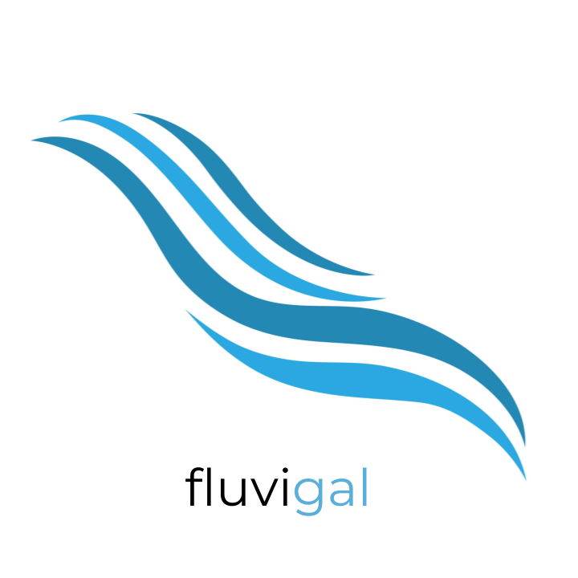

# fluvigal

## Descrición

__fluvigal__ (_fluvi_ de [fluvial](https://academia.gal/dicionario/-/termo/fluvial) e _gal_ de [Galicia](https://gl.wikipedia.org/wiki/Galicia)) é unha implementación tanto móbil como web dunha aplicación que facilita e amosa ao público, os datos do estado actual dos ríos galegos (o nivel e caudal da auga), así como o estado actual das estacións na rede de aforos que actualmente están en servizo en Galicia (actualizado cada 10 minutos).

Unha estación de aforo, é un punto situado no cauce dun río, onde se controla o nivel e caudal que circula por éste. A aplicación encargarase de recopilar estes datos, fundamentais para o correcto seguimento dos episodios de seca e enchente, e de facilitalos a usuarios de todo tipo, xa sexan particulares, empresas ou organizacións non gubernamentais, como información de especial interese ante a situación de cambio climático e quecemento global que sofre o noso planeta.

## Instalación / Posta en marcha

Para obter o repositorio en local, é preciso empregar a ferramenta de terminal `git`:

    git clone https://gitlab.iessanclemente.net/damo/a16alejandrobp.git

### Produto final

O produto final, como foi indicado anteriormente, consta dunha implementación web e outra móbil (Android), polo cal, lóxicamente serán accesibles de dúas formas diferentes.

#### Aplicación web (fluvigal-web)

Para acceder á webapp para probala, será tan sinxelo como seguir esta [ligazón](http://104.198.73.152). No caso de que o navegador non soporte hipervínculos, será preciso pegar a seguinte liña na barra de direccións:

    http://104.198.73.152

O código fonte está accesible dende [fluvigal/fluvigal-web](fluvigal/fluvigal-web).

#### Aplicación móbil (fluvigal-mob)

A versión da aplicación para dispositivos móbiles é compatible con terminais Android coa versión X.Y (por determinar) como mínimo. Para probala dende un computador será preciso un emulador de Android coa mesma versión mínima que a indicada anteriormente. 

O ficheiro APK está atópase ubicado [aquí](). O código fonte está accesible dende [fluvigal/fluvigal-mob](fluvigal/fluvigal-mob).

### Contorno e infraestrutura (Avanzado)

A posta en marcha da infraestrutura baséase na configuración de __ds-fluvigal__, a instancia de Debian 10 que actúa como servidor encargado de procesar e almacenar os datos da rede de aforos. As instruccións da configuración atópanse [aquí](fluvigal/ds-fluvigal). A instancia aloxa tamén os seguintes servizos:

#### Base de datos MariaDB (fluvigal_db)

Será necesaria unha carga inicial de modelado e rexistros na base de datos, o script está ubicado [aquí](fluvigal/ds-fluvigal/fluvigal_db.sql). 

#### Aplicación backend Python (fluvigal-pr)

Engargada das peticións externas, do seu procesamento e da actualización continua da base de datos. O script de instalación atópase [aquí](fluvigal/fluvigal-pr/fluvigal-pr-setup.sh).

## Uso

> *TODO*: Es este apartado describe brevemente cómo se usará el software que proyectas. Si tiene una interfaz de terminal, describe aquí su sintaxis. Si tiene una interfaz gráfica de usuario, describe aquí **sólo el uso** (a modo de sumario) **de los aspectos más relevantes de su funcionamiento** (máxima brevedad, como si fuese un anuncio reclamo o comercial).
> Si tu proyecto es documental, realiza una especificación de cómo planteas estas interfaces, con ejemplos incluso o esquemas de diseño. En otras palabras, realiza este apartado independientemente que no haya implementación.

## Sobre o autor

> *TODO*: Realiza una breve descripción de quien eres (perfil profesional), tus puntos fuertes, o tecnologías que más dominas... y porqué te has decantado por este proyecto. **No más de 200 palabras**. Indica la forma fiable de contactar contigo en el presente y en el futuro.

## Licenza

> *TODO*: Es requisito INDISPENSABLE el licenciar explícitamente el proyecto software. Se recomienda licenciar con *GNU Free Documentation License Version 1.3*. Crear un fichero `LICENSE` en la raiz del repo, con tu fichero de licencia. Recuerda que si empleas una licencia de software libre estás autorizando la derivación de tu obra bajo la misma licencia que elijas, pudiendo dar continuidad, p. e. otro alumno, para continuar tu proyecto en otro curso.
> Si tu proyecto es documental, recomendamos los términos de *GNU Free Documentation License Version 1.3*, crea igualmente el fichero `LICENSE`. Será especialmente valorado en este caso, la claridad de la especificación para que el proyecto pueda ser ejecutado partiendo de lo proyectado.

## Índice

1. [Idea](doc/1_idea.md) 
2. [Necesidades](doc/templates/2_necesidades.md) (Por facer)
3. [Análise](doc/templates/3_analise.md) (Por facer)
4. [Deseño](doc/4_deseño.md) (Incompleto)
5. [Planificación](doc/templates/5_planificacion.md) (Por facer)
6. [Implantación](doc/templates/6_implantacion.md) (Por facer)

## Guía de contribución

> *TODO*: Tratándose de un proyecto de software libre, es muy importante que expongas cómo se puede contribuir con tu proyecto. Algunos ejemplos de esto son realizar nuevas funcionalidades, corrección y/u optimización del código, realización de tests automatizados, nuevas interfaces de integración, desarrollo de plugins, etc. etc. Sé lo más conciso que puedas.

## Links

> *TODO*: Enlaces externos y descipciones de estos enlaces que creas conveniente indicar aquí. Generalmente ya van a estar integrados con tu documentación, pero si requieres realizar un listado de ellos, este es el lugar.