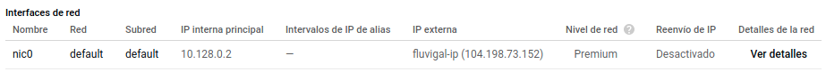
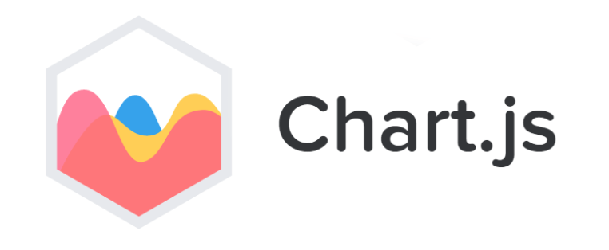
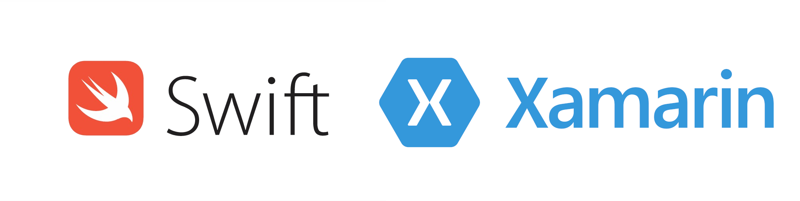

# REQUIRIMENTOS DO SISTEMA
Este documento describe os requirimentos para **fluvigal** especificando que funcionalidade ofrecerá e de que xeito.

## Descrición Xeral

__fluvigal__ é unha implementación tanto móbil como web dunha aplicación que facilita e amosa ao público, os datos do estado actual dos ríos galegos (o nivel e caudal da auga), así como o estado actual das estacións na rede de aforos que actualmente están en servizo en Galicia (actualizado cada 10 minutos).

Unha estación de aforo, é un punto situado no cauce dun río, onde se controla o nivel e caudal que circula por éste. A aplicación encargarase de recopilar estes datos, fundamentais para o correcto seguimento dos episodios de seca e enchente, e de facilitalos a usuarios de todo tipo, xa sexan particulares, empresas ou organizacións non gubernamentais, como información de especial interese ante a situación de cambio climático e quecemento global que sofre o noso planeta.

## Funcionalidades

Todas as funcionalidades descritas a continuación son as incluídas nas aplicacións cliente (web e móbil), nas que os únicos actores son usuarios anónimos xa que a aplicación non ten autenticación debido a que ao menos por agora, non é preciso xa que é unha ferramenta de consulta de datos públicos. Estas funcionalidades son:

1. Listar os ríos pertencentes á rede de aforos galega.
2. Listar as estacións pertencentes á rede de aforos galega, podendo filtrar por río.
3. Consultar o estado actual do nivel dos ríos galegos.
4. Consultar o estado actual do caudal dos ríos galegos.
5. Consultar a localización exacta das estacións que realizan estas medicións mediante __Google Maps__.
6. Actualización automática dos datos cada 10 minutos.
 
## Requerimentos non funcionais (por facer)

Requerimentos relativos a rendemento, seguridade, etc. se procede

## Tipos de usuarios

Como é comentado no apartado de [Funcionalidades](#Funcionalidades), nas aplicacións cliente non existe autenticación, máis no backend, á hora de operar na base de datos, sí é preciso ter certo control en base ao seguintes usuarios, cos correspondentes permisos:

| Usuario | SELECT | CREATE | DROP | INSERT | UPDATE | DELETE | Observacións
|:-       |:-      |:-      |:-    |:-      |:-      |:-      |:-   
| 'usuario'@'localhost' | X | X | X | X | X | X | Encargado de modificar a BD. Uso exclusivo no servidor. 
| ''@'%' | X |  |  |  |  |  | Empregado polos clientes para consultar remotamente os datos e mostralos nas interfaces. É anónimo e non ten contrasinal xa que son datos públicos.
 
## Contorno operacional

> **IMPORTANTE**: En todo o contorno é precisa unha conexión a internet para un correcto funcionamento.

### Hardware requerido

***

#### Servidor

O servidor [ds-fluvigal](../fluvigal/ds-fluvigal) é unha instancia en Google Cloud de tipo *n1-standard-1*:

| Tipo              | Requerido
|:-                 |:-
| CPU               | **1 vCPU**
| Plataforma de CPU | **Intel Haswell**
| Memoria RAM       | **3,75 GB**
| Zona              | **us-central1-a**
| Disco             | **10GB HDD**

#### Clientes

Os dispositivos que empreguen a aplicación cliente web precisarán cumprir os requerimentos esixidos polos navegadores máis comúns, xa que se executará sobre eles. Aquí está o exemplo de [Firefox](https://support.mozilla.org/en-US/kb/supported-platforms-and-system-requirements).

Os terminais móbiles que instalarán a aplicación cliente móbil precisarán cumprir os requerimentos esixidos por **Android Nougat**: 
+ Arquitectura ARM v5 ou maior
+ 512MB de Memoria RAM
+ 8GB de Almacenamento Interno

#### Equipos de desenvolvemento

Nos equipos de desenvolvemento, os requerimentos hardware serían os precisos para traballar cómodamente con IDEs como [Android Studio](https://es.wikipedia.org/wiki/Android_Studio#Plataformas) ou [Visual Studio Code](https://code.visualstudio.com/docs/supporting/requirements).

### Software

***

#### Servidor

No servidor [ds-fluvigal](../fluvigal/ds-fluvigal) instalarase de base o sistema operativo **Debian 10** cos servizos *MariaDB* e *Apache Tomcat* (no que se executará [fluvigal-web](../fluvigal/fluvigal-web)), ademáis de [fluvigal-pr](../fluvigal/fluvigal-pr).

#### Clientes

Para os clientes web o sistema operativo é de libre elección e esa é a principal vantaxe do seu desenvolvemento. Bastaría con poder instalara un navegador web como *Mozila Firefox*, *Google Chrome*, *Microsoft Edge*, *Opera* ou *Safari*.

Para os clientes móbiles precisarase como mínimo Android Nougat (7.0) e nel instalar a implementación [fluvigal-mob](../fluvigal/fluvigal-mob).

#### Equipos de desenvolvemento

Para os equipos de desenvolvemento, o sistema operativo deberá estar marcado polas posibilidades que ofrezan os requerimentos de *Android Studio* e *Visual Studio Code*, que son os IDEs empregados para o seu desenvolvemento.

## Interfaces externas

Ao ser **fluvigal** un proxecto cunha importante infraestrutura por detrás, a comunicación entre as diferentes partes é esencial para o seu funcionamento.

### Interfaces de usuario

As interfaces de usuario das implementacións tanto web como móbil, basearase en pestanas "Estacións" e "Ríos" que levarán a seccións ou pantallas que listen cada un dos elementos correspondentes. Ao facer click en cada un deles, mostrarán a información ou subelementos relativos. Os diagramas de deseño das interfaces de usuario están no apartado de [Deseño](4_deseño.md).

### Interfaces hardware

A interface hardware esencial en **fluvigal** é a súa interface de rede, esta será pola cal os clientes se comunicarán co servidor e tamén pola que o servidor poderá actualizar os seus datos cada 10 minutos. A información básica reflectida sobre a interface de rede en *Google Cloud Console* é a seguinte:

Para os clientes, citar tamén os periféricos como monitor, teclado e rato se procede ou a pantalla táctil nos terminais móbiles. Ademáis dunha interface de rede propia coa que conectar con **fluvigal**.

### Interfaces software

As interfaces software máis importantes de **fluvigal** son [fluvigal-pr](../fluvigal/fluvigal-pr) (encargada de comunicarse co servidor da Xunta e procesar os datos reais e introducilos na base de datos) e [fluvigal-op](../fluvigal/fluvigal-op) (encargada de comunicar ás aplicacións cliente coa base de datos para realizar as consultas correspondentes).

## Melloras futuras

O proxecto **fluvigal** está suxeito a análises para a súa mellora continua. A día de hoxe, as melloras futuras que se contemplan nun curto prazo son:

### Histórico e gráficas con Chart.js

Os cambios comezarían dende a propia base de datos, onde en vez de actualizar as medicións cada 10 minutos, engadiríanse outras novas e a data comezaría a formar parte da clave primaria.

Por defecto nos clientes mostraríase a actualización máis recente, visualizando os datos nunha gráfica con liña de tempo, estas gráficas implementaríanse mediante [Chart.js](https://www.chartjs.org/) de forma moi sinxela ao ser unha biblioteca JavaScript completamente compatible con servlets JSP como é o caso do noso cliente web, e a posibilidade de engadilo ao cliente móbil mediante obxectos WebView.

### Desenvolvemento de app para iOS

Para completar o desenvolvemento móbil, sería convinte a creación dun cliente para dispositivos iOS, isto podería levarse a cabo de dous xeitos que serán debatidos no futuro, pero que quedan aquí expostos:

+ a) ***Desenvolvemento nativo con Swift e Xcode***: implicaría máis modularización do código, polo tanto, sería preciso software máis específico e máis traballo, pero tamén maior coñecemento das posibilidades de explotación da app ao estar empregando o contorno [Xcode](https://developer.apple.com/xcode/) e linguaxe [Swift](https://developer.apple.com/swift/) propios e oficiais de Apple.

+ b) ***Migración de todo o desenvolvemento móbil a Xamarin***: implicaría unificar todo o desenvolvemento de clientes para dispositivos móbiles na plataforma [Xamarin](https://dotnet.microsoft.com/apps/xamarin) de Microsoft, estando suxeito ás condicións desta plataforma e desenvolvendo e C#. De primeiras produciría un cambio moi importante no contorno e unha formación extra, pero a longo prazo, co mesmo traballo, desenvolveríanse ambas as aplicacións para Android e iOS.

### Outros

+ Comparacións cos caudais ecolóxicos para comprobar a variación do caudal actual respecto a este.
+ Mellora da interface, ofrecendo imaxes de cada río ou información extra.
+ Implementación de [Docker](https://www.docker.com/).
