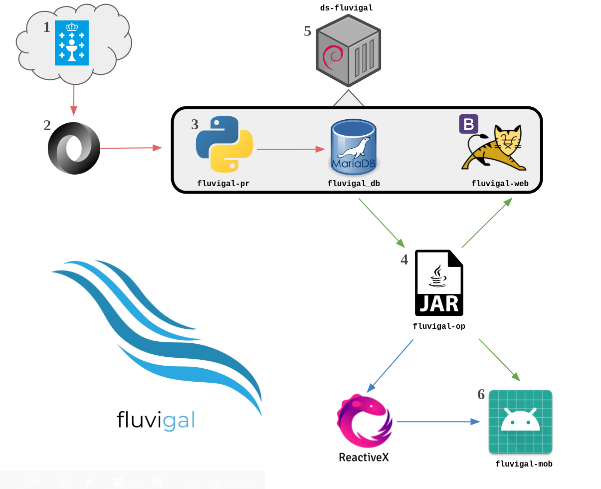
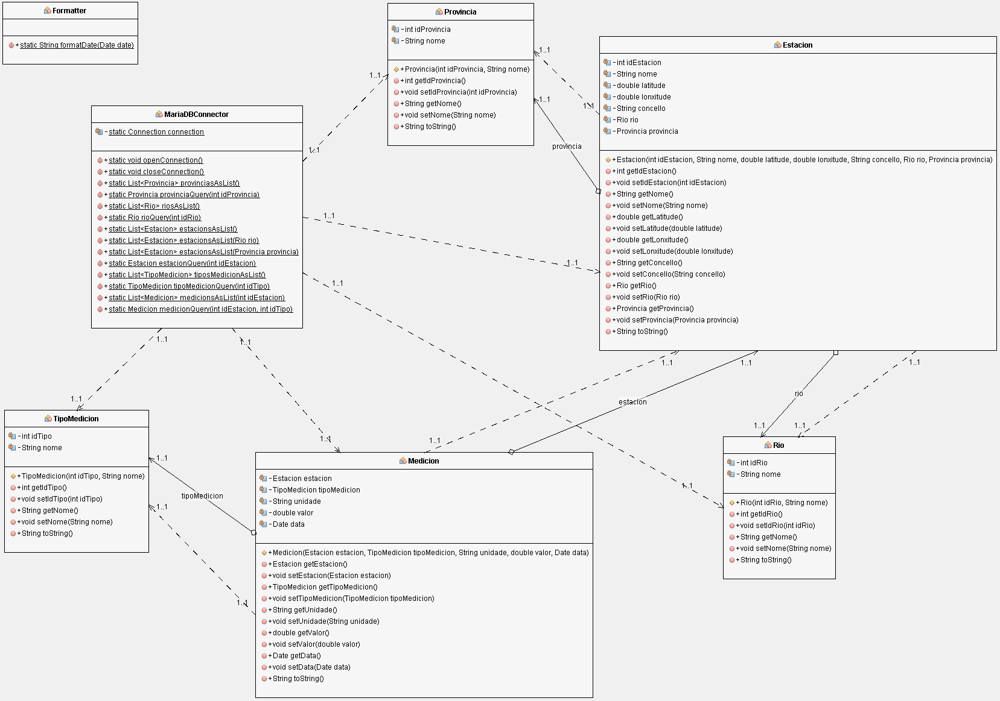
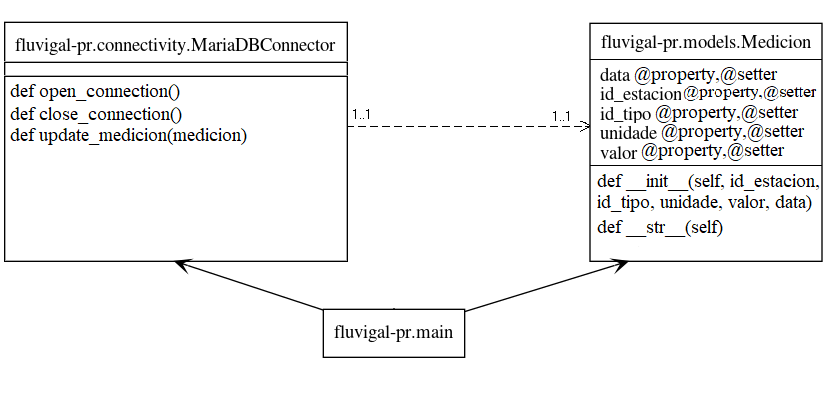
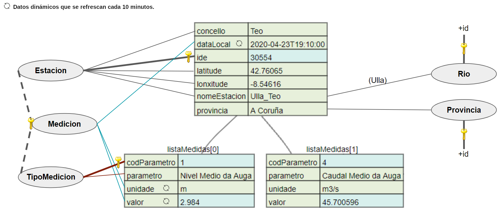
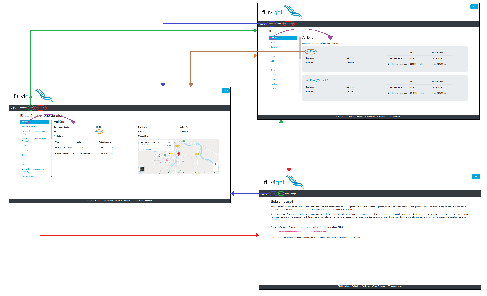
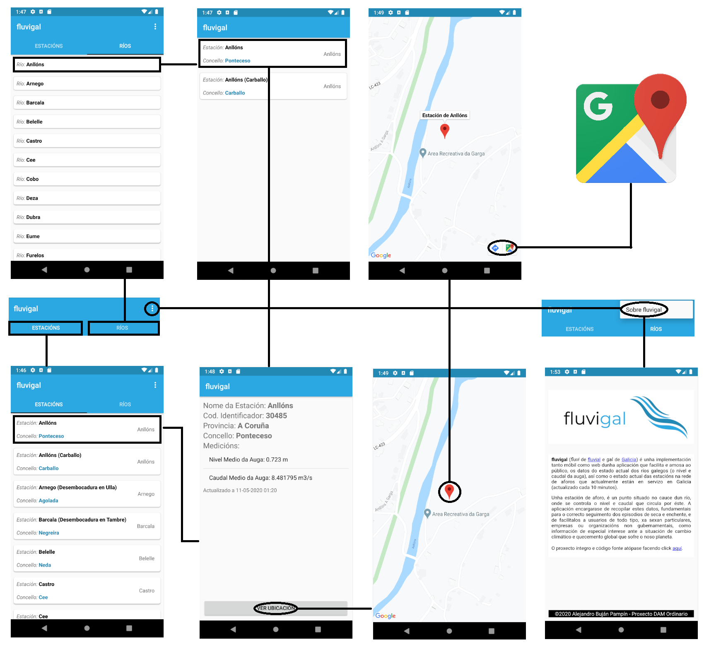
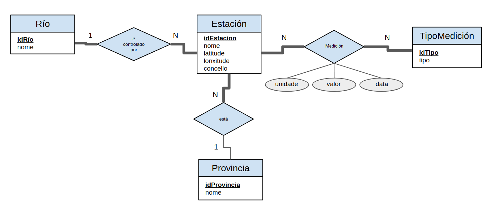

# FASE DE DESEÑO

## Diagrama de compoñentes software que constitúen o produto e de despregue

### Elementos
1. Servidor de Datos Abertos da Xunta de Galicia.

2. Ficheiro JSON cos datos hidrográficos.

3. Aplicación Python desenvolta por min que acceda, procese o ficheiro JSON e actualice a BD.

4. Librería JAR desenvolta por min que conteña as clases que modelan as táboas da BD en ORM, con métodos que permiten facer consultas e recibir obxectos.

5. LXD Container (en produción optarase por Docker) Debian 10 cos seguintes servizos:
    + MySQL onde se almacenen os datos procesados.
    + Apache Tomcat que aloxará a aplicación en JSP desenvolta por min que mostre os datos a través do JAR. Interface xerada con Bootstrap.

6. Aplicación Android desenvolta por min que empregue o JAR para acceder á BD.
### Rutas
+ Vermella: A aplicación Python permite o acceso ao servidor da Xunta de Galicia para descargar os datos, procesalos e actualizar a BD.

+ Verde: A librería JAR permite a ambas aplicacións consultar os datos da BD e recibilos como obxectos.

+ Azul: A tecnoloxía ReactiveX é empregada na App Android (con RxJava e RxAndroid) para controlar a concurrencia, fluxos e evitar memory leak, especialmente en requests que empregan a librería JAR..

## Modelo conceptual do dominio da aplicación e/ou Diagrama de clases

### fluvigal-op

### fluvigal-pr

#### Estrutura do ficheiro JSON procesado

## Casos de uso [descritos en fichas e/ou mediante esquemas; deben incluír o(s) tipo(s) de usuario implicados en cada caso de uso] (por facer)

## Deseño de interface de usuarios

### fluvigal-web

### fluvigal-mob

## Diagrama de Base de Datos

