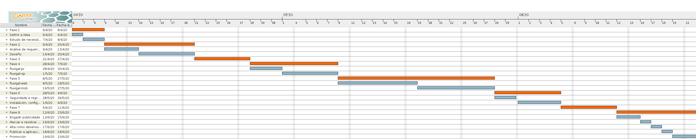

# FASE DE PLANIFICACIÓN DO PROXECTO

## Guía de planificación do proxecto

### Metodoloxía prevista

Como se contemplou no [Estudo de Necesidades](2_necesidades.md), a metodoloxía escollida para levar a cabo o proxecto nesta versión inicial, ao ser un desenvolvemento individual e sen interactividade co cliente, será *Waterfall*, pero á hora de escalar, adaptar, ou ampliar a solución no futuro, sería apropiado empregar metodoloxías áxiles como SCRUM, estando en contacto constante coas entidades interesadas, que neste caso, actuarían como cliente.

### Fases planificadas

> **Nota:** En todálas fases e tarefas, os recursos humanos referencian sempre a min mesmo, podendo ser aconsellado por expertos en cada unha das materias específicas que se traten.

#### Fase 1: Estudo de necesidades e modelo de negocio

##### Tarefa 1: Definir a idea

Descrición: Plasmar e xustificar o porqué da idea de **fluvigal**.

Recursos hardware/software: Computador de gama media (Ubuntu) con conexión a internet.

Duración: 1 día.

##### Tarefa 2: Estudo de necesidades

Descrición: Realizar un estudo de necesidades acorde ao proxecto, no que se avalíe a súa viabilidade e comercialización.

Recursos hardware/software: Computador de gama media (Ubuntu) con conexión a internet.

Duración: 2 días.

#### Fase 2: Análise de requerimentos e deseño

##### Tarefa 1: Análise de requerimentos

Descrición: Coñecer e examinar a materia do proxecto: Que se precisa? Que se vai lograr? Como se poderá mellorar? É importante investigar e indagar no funcionamento de tódolos recursos que se poderán empregar no desenvolvemento.

Recursos hardware/software: Computador de gama media (Ubuntu) con conexión a internet.

Duración: 3 días.

##### Tarefa 2: Deseño

Descrición: Plasmar de forma conceptual e gráfica, o funcionamento de todo o contorno do proxecto, entrando xa en apartados técnicos.

Recursos hardware/software: Computador de gama media (Ubuntu) con conexión a internet e software específico para a elaboración de diagramas e conceptos visuais como *GIMP* ou *Dia*.

Duración: 5 días.

#### Fase 3: Aplicación básica do concepto

Descrición: Nesta fase buscarase crear un contorno de proba no que se poida comprobar se é posible e de qué forma, levar a cabo unha implementación seria e con funcionalidade real. Preténdese coñecer a compatibilidade óptima entre versións de diferentes tipos de software empregados ou probar a conectividade co servidor de Datos Abertos.

Recursos hardware/software: Computador de gama media (Ubuntu) con conexión a internet e software específico para o desenvolvemento (*Visual Studio Code*, *Android Studio*) e despregue (*LXD Containers*).

Duración: 5 días.

#### Fase 4: O backend

##### Tarefa 1: Desenvolvemento de [fluvigal-pr](../fluvigal/fluvigal-pr)

Subtarefas: 

+ Desenvolver na linguaxe *Python* un programa que sexa capaz de realizar as peticións correspondentes ao servidor de Datos Abertos e actualizar a base de datos procesando o ficheiro que éste emite. 
+ Mediante scripting en *bash* crear tamén un instalador que ademáis (instale e) configure o *cron* para realizar esas peticións cada 10 minutos. 
+ Documentar o funcionamento mediante *Pydoc*.
+ Probas e depuración do sistema.

Recursos hardware/software: Computador de gama media (Ubuntu) con conexión a internet e software específico para o desenvolvemento (*Visual Studio Code*) e despregue (*LXD Containers*).

Duración: 3 días.

##### Tarefa 2: Desenvolvemento de [fluvigal-op](../fluvigal/fluvigal-op)

Subtarefas: 

+ Desenvolver na linguaxe *Java* unha libraría que xere conexións de consulta á base de datos e modele as táboas podendo recuperar os datos en obxectos. Esta libraría será a que se empregue para comunicarse coas interfaces. 
+ Documentar o funcionamento mediante *Javadoc*.
+ Probas e depuración do sistema.

Recursos hardware/software: Computador de gama media (Ubuntu) con conexión a internet e software específico para o desenvolvemento (*Visual Studio Code*) e despregue (*LXD Containers*).

Duración: 5 días.

#### Fase 5: O frontend

##### Tarefa 1: Desenvolvemento de [fluvigal-web](../fluvigal/fluvigal-web)

Subtarefas: 
+ Mediante o emprego de *JavaServer Pages*, *BootStrap*, *HTML5* e *CSS*, crear unha interface web, cómoda e visual, que permita mostrar, a través de [fluvigal-op](../fluvigal/fluvigal-op), os datos existentes na base de datos.
+ Probas e depuración do sistema.

Recursos hardware/software: Computador de gama media (Ubuntu) con conexión a internet e software específico para o desenvolvemento (*Visual Studio Code*) e despregue (*LXD Containers*).

Duración: 7 días.

##### Tarefa 2: Desenvolvemento de [fluvigal-mob](../fluvigal/fluvigal-mob)

Subtarefas: 
+ Mediante o emprego do *Android SDK* e a tecnoloxía de programación reactiva *ReactiveX*, crear unha interface móbil, cómoda e visual, que permita mostrar, a través de [fluvigal-op](../fluvigal/fluvigal-op), os datos existentes na base de datos. 
+ Conectar tamén a aplicación á API de Google Maps mediante Google Cloud e unha API key para traballar con mapas.
+ Probas e depuración do sistema.

Recursos hardware/software: Computador de gama media (Ubuntu) con conexión a internet e software específico para o desenvolvemento (*Android Studio*) e despregue (*LXD Containers*).

Duración: 7 días.

#### Fase 6: Administración do servidor

##### Tarefa 1: Seguridade e regras de cortalumes

Subtarefas: 
+ Nunha instancia de servidor Debian 10 en Google Cloud, engadir unha dirección IP pública e estática.
+ Definir regras no cortalumes que permitan o tráfico de entrada aos portos 22 (para acceder por SSH), 80 (para a páxina web) e 3306 (para o acceso remoto a MariaDB).
+ Permitir tamén o tráfico ICMP (para comprobar conectividade). 
+ O acceso por SSH estará limitado en base a claves pública/privada, polo que haberá que transferir a clave pública do equipo de desenvolvemento para acceder.

Recursos hardware/software: Computador de gama media (Ubuntu) con conexión a internet e instancia *n1-standard-1* en Google Cloud.

Duración: 2 días.

##### Tarefa 2: Instalación, configuración de servizos e migración da aplicación

Descrición: 
+ Poñer en marcha o servidor para que a aplicación estea operativa. 
+ Instalar e configurar todos os servizos necesarios.
+ Realizar unha carga inicial de datos na base de datos.
> **Nota:** As instruccións estan detalladas en [ds-fluvigal](../fluvigal/ds-fluvigal).

Recursos hardware/software: Computador de gama media (Ubuntu) con conexión a internet e instancia *n1-standard-1* en Google Cloud.

Duración: 4 días.

#### Fase 7: Ensaios e tests

Descrición: Nesta fase comprobarase o funcionamento da infraestrutura mediante diversas probas como a instalación da aplicación móbil en diversos dispositivos físicos ou o acceso á aplicación web dende un dispositivo móbil para comprobar que é *responsive* ou para coñecer a experiencia de usuario. O obxectivo é atopar e correxir erros que se poidan presentar.

Recursos hardware/software: Computador de gama media (Ubuntu) con conexión a internet, instancia *n1-standard-1* en Google Cloud, software específico para o desenvolvemento (*Visual Studio Code*, *Android Studio*). Dispositivos físicos Android varios coa versión 7.0 ou superior.

Duración: 5 días.

#### Fase 8: Distribución e comercialización

##### Tarefa 1: Engadir publicidade

Descrición: Trata de engadir publicidade coa que monetizar a nosa aplicación mediante Google AdSense (para a aplicación web) e Google AdMob (para a aplicación móbil). Supón engadir fragmentos de código aos lugares apropiados onde situar a publicidade. 

Recursos hardware/software: Computador de gama media (Ubuntu) con conexión a internet, instancia *n1-standard-1* en Google Cloud, software específico para o desenvolvemento (*Visual Studio Code*, *Android Studio*).

Duración: 2 días.

##### Tarefa 2: Mercar e rexistrar un dominio

Descrición: Estudar o nome de dominio máis axeitado para o rexistro da nosa aplicación web e adquirilo na plataforma coa mellor relación calidade-prezo.

Recursos hardware/software: Computador de gama media (Ubuntu) con conexión a internet e instancia *n1-standard-1* en Google Cloud.

Duración: 1 día.

##### Tarefa 3: Alta como desenvolvedor en Google Play

Descrición: Mediante un desembolso previo de 25 euros, rexistrarnos cunha conta de desenvolvedor en Google Play Console, aportando os nosos datos e información relativa a nós. 

Recursos hardware/software: Computador de gama media (Ubuntu) con conexión a internet e instancia *n1-standard-1* en Google Cloud.

Duración: 1 día.

##### Tarefa 4: Publicar a aplicación móbil

Descrición: Trata de poñer a disposición do público, a nosa aplicación na tenda de Google Play de forma gratuíta, tras unha avaliación previa do contido da aplicación feita polo equipo de Google.

Recursos hardware/software: Computador de gama media (Ubuntu) con conexión a internet e instancia *n1-standard-1* en Google Cloud.

Duración: 1 día.

##### Tarefa 5: Promoción

Descrición: Mediante o emprego das redes sociais e o estudo para optimizar o posicionamento SEO da nosa aplicación web, dar a coñecer a nosa solución de software.

Recursos hardware/software: Computador de gama media (Ubuntu) con conexión a internet e instancia *n1-standard-1* en Google Cloud.

Duración: 3 días.

### Diagrama de Gantt

## Orzamento
Os datos a ter en conta á hora de calcular o orzamento son:

+ ***Man de obra***: Contamos cun Programador Junior, polo que hai que pagar, aproximadamente (entre salario e deduccións) 57,28€ por cada xornada laboral de 8 horas.
+ ***Consumo enerxético***: Cun precio medio de 0,077€/kWh e tendo o equipo de traballo unha fonte de alimentación de 650W, o montante a pagar sería de 0,41€ nunha xornada laboral de 8 horas.
+ ***Outros***: Importes de pago único como a alta como desenvolvedor en Google Play (25€).

> **Nota:** No calculo do orzamento non contemplo o custo da plataforma de despregue, xa que neste caso, para facilitar as demostracións estou empregando Google Cloud polo meu interés por aprender do mundo do cloud computing e polo seu **crédito gratuíto**, co cal non supón gasto algún durante a etapa de desenvolvemento, aínda que, o prezo **ficticio** que estou "pagando" por día e de aproximadamente 1,05€. Nun escenario de producción o apropiado sería realizar unha avaliación pertinente na que en base aos beneficios e ás necesidades para o seu despregue, se escolla a plataforma axeitada. Tampouco se reflicten os custos da merca do dominio, xa que varían moito dependendo dos [ccTLD](https://es.wikipedia.org/wiki/Dominio_de_nivel_superior_geogr%C3%A1fico) (.es,.gal,.com), e habería que analizar cal sería a opción máis convinte en termos tanto económicos como de marketing.

### Orzamento por actividade

| ACTIVIDADE | DURACIÓN | CUSTO (EUROS)
|--|--|--|
|Fase 1|3 días|173,05|
|Fase 2|8 días|461,45|
|Fase 3|5 días|288,41|
|Fase 4|8 días|461,45|
|Fase 5|14 días|807,53|
|Fase 6|6 días|346,09|
|Fase 7|5 días|288,41|
|Fase 8|8 días|486,45|
| **TOTAL** |**57 días**|**3312,84**|

### WEBGRAFÍA
Guía para a elaboración de proyectos. Gobierno Vasco.
https://www.pluralismoyconvivencia.es/upload/19/71/guia_elaboracion_proyectos_c.pdf  (páxina 49 e seguintes)

