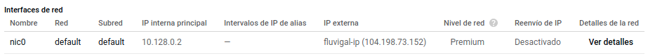

# FASE DE IMPLANTACIÓN

## Manual técnico

### Información relativa á instalación

#### Requirimentos de hardware

Os requerimentos de hardware para cada un dos tipos de equipos que participan no proxecto están detallados na sección "Hardware Requerido" de [Análise](3_analise.md#hardware-requerido).

#### Software necesario

O software necesario para cada un dos tipos de equipos que participan no proxecto están detallados na sección "Software" de [Análise](3_analise.md#software).

#### Configuración inicial seguridade

Regras de devasa:

+ Permitir o tráfico de entrada aos portos 22 (para acceder por SSH), 80 (para a aplicación web) e 3306 (para o acceso remoto a MariaDB).
+ Permitir tamén o tráfico ICMP (para comprobar conectividade). 
+ O acceso por SSH estará limitado en base a claves pública/privada, polo que haberá que transferir a clave pública do equipo de desenvolvemento para acceder.

Engadiuse unha dirección IP pública e estática á instancia.
A información básica reflectida sobre a interface de rede en *Google Cloud Console* é a seguinte:

#### Carga inicial de datos na base de datos

No momento da instalación da base de datos, é preciso realizar unha carga inicial coa información estática, é dicir a información que non se refresca (as estacións que pertencen a cada río, a provincia na que se atopa cada estación, as súas coordenadas...). Esta información obteuse dun xeito híbrido (manual-automático) dende o ficheiro JSON, ao que se lle aplicou un certo formato para derivar nunha estrutura de datos máis eficaz. Esta carga está no ficheiro [fluvigal_db.sql](../fluvigal/ds-fluvigal/fluvigal_db.sql).

#### Usuarios do sistema. Usuarios da aplicación

Nas aplicacións cliente, non existe autenticación ao estar consultando datos públicos, máis no backend, á hora de operar na base de datos, sí é preciso ter certo control en base ao seguintes usuarios, cos correspondentes permisos:

| Usuario | SELECT | CREATE | DROP | INSERT | UPDATE | DELETE | Observacións
|:-       |:-      |:-      |:-    |:-      |:-      |:-      |:-   
| 'usuario'@'localhost' | X | X | X | X | X | X | Encargado de modificar a BD. Uso exclusivo no servidor. 
| ''@'%' | X |  |  |  |  |  | Empregado polos clientes para consultar remotamente os datos e mostralos nas interfaces. É anónimo e non ten contrasinal xa que son datos públicos.

### Información relativa á administración do sistema, é dicir, tarefas que se deberán realizar unha vez que o sistema estea funcionando, como por exemplo:

* Copias de seguridade do sistema.
* Copias de seguridade da base de datos.
* Xestión de usuarios.
* Xestión seguridade.
* Xestión de incidencias, que poden ser de dous tipos: de sistema (accesos non autorizados á BD, etc) ou de fallos no software.

### Información relativa ó matemento do sistema: 

* Corrixir erros.
* Engadir novas funcionalidades.
* Adaptación por actualizacións de software e/ou hardware.

## Xestión de incidencias

Poden ser incidencias de dous tipos: de sistema (accesos non autorizados á BD, etc) ou de fallos no software.

## Protección de datos de carácter persoal.

Este software non almacena datos de carácter persoal, polo tanto, neste caso, a LOPD-GDD non é aplicada.

## Manual de usuario

* Indicar se será necesario formar ós usuarios. En caso afirmativo planificar.
* Manual de usuario, FAQ ou outro xeito que sexa o máis adecuado para que os usuarios saiban usar a nosa aplicación informática.
