# Manual de usuario

## Introdución

Neste documento, exporase dun xeito breve e conciso, o funcionamento das interfaces de **fluvigal**, tanto web como móbil, de forma que un usuario sen coñecementos previos poida ser capaz de empregala correctamente.

## [fluvigal-web](../fluvigal/fluvigal-web)

A aplicación web está accesible dende:

    http://104.198.73.152

### Páxina principal (Estacións)

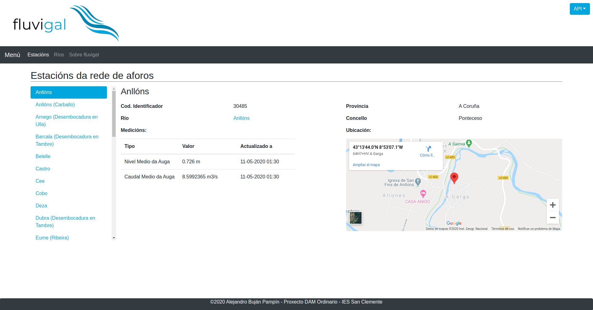

Esta é a páxina que aparecerá por defecto ao acceder á aplicación, aquí poderánse consultar os datos das estacións, e as medicións que estas ofrecen. 

Na parte esquerda da interface podemos visualizar un listado desprazable cos nomes da estacións da rede de aforos galega, ordenados alfabéticamente, e ao facer click en calquera deles, levarasenos á páxina correspondente a cada unha.

Á dereita podemos observar os datos da estación que estea seleccionada no listado da esquerda, así como as medicións actualizadas á data mostrada. No mapa aparecerá a ubicación exacta por coordenadas da estación seleccionada, no que poderemos activar a vista satélite ou trazar unha ruta mediante Google Maps. Ao facer click no valor do Río iremos á páxina do río correspondente, onde observaremos as outras estacións que o controlan.

Na barra superior de menú poderemos desprazarnos ás páxinas "Ríos" e "Sobre fluvigal" facendo click no seus elementos correspondentes.

### Ríos

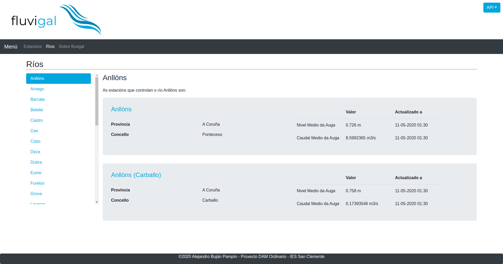

Esta é a páxina que aparecerá ao facer click no elemento "Ríos" do menú superior. Aquí poderánse consultar os datos as estacións filtradas por cada un dos ríos, e as medicións que estas ofrecen. 

Na parte esquerda da interface podemos visualizar un listado desprazable cos nomes dos ríos controlados por Augas de Galicia, ordenados alfabéticamente, e ao facer click en calquera deles, levarasenos á páxina correspondente a cada un.

Á dereita podemos observar as estacións que controlan o río que estea seleccionado no listado da esquerda, así como as medicións actualizadas á data mostrada. Ao facer click no nome dalgunha estación, iremos á súa páxina correspondente, onde obteremos máis información dela.

Na barra superior de menú poderemos desprazarnos ás páxinas "Estacións" e "Sobre fluvigal" facendo click no seus elementos correspondentes.

### Sobre fluvigal

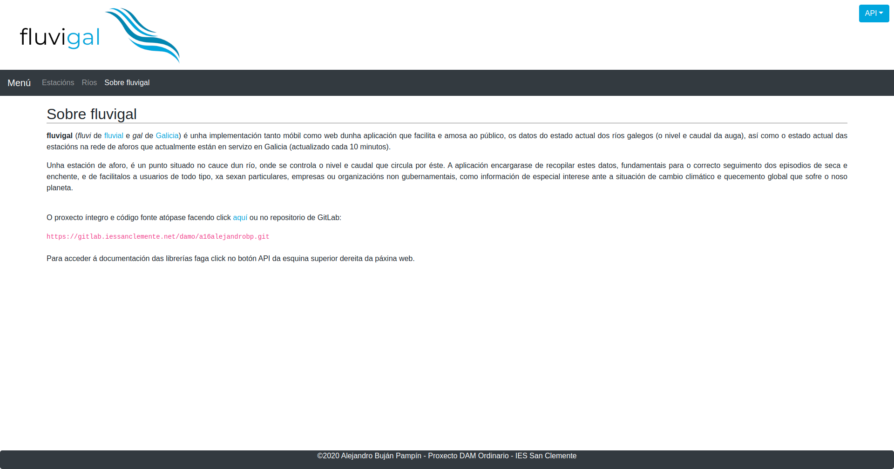

Esta é a páxina que aparecerá ao facer click no elemento "Sobre fluvigal" do menú superior. Aquí relátase información sobre o proxecto e onde atopar o código fonte e a documentación. 

Na barra superior de menú poderemos desprazarnos ás páxinas "Estacións" e "Ríos" facendo click no seus elementos correspondentes.

## [fluvigal-mob](../fluvigal/fluvigal-mob)

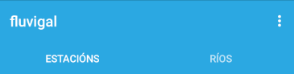

Ao abrir a aplicación móbil, observaremos que está dividida en dúas pestanas, a de estacións e a de ríos. Poderémonos desprazar entre unha e outra ao facer click e cada unha delas ou ao desprazar o dedo cara á esquerda ou dereita dependendo de en cal nos atopemos.

### Estacións

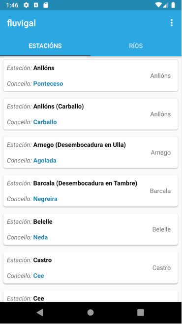

De primeiras, na pestana das estacións, poderemos atopar un listado desprazable cos nomes da estacións da rede de aforos galega co seu concello e o seu río, ordenados alfabéticamente por nome de estación, e ao facer click en calquera deles, levarasenos á seguinte pantalla, correspondente á seleccionada previamente:

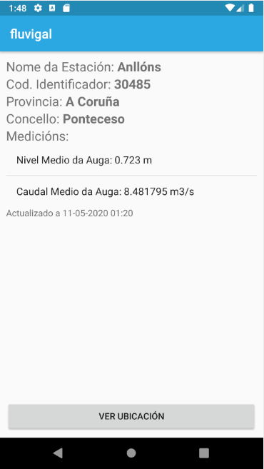

Nesta pantalla poderemos observar os datos relativos á estación seleccionada na pantalla anterior, así como as medicións actualizadas á data mostrada.

Ao facer click no botón "Ver Ubicación" abriremos un mapa onde se reflicte a ubicación exacta da estación correspondente:

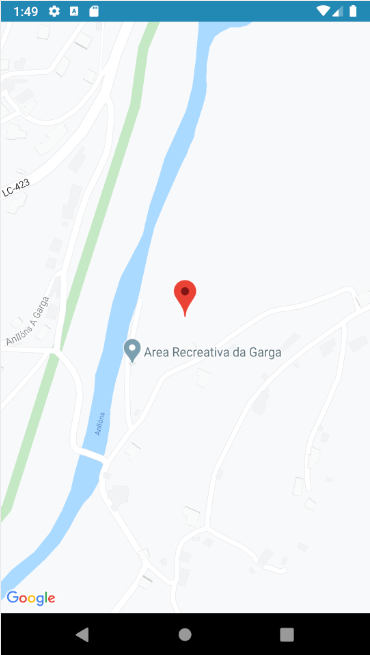

Ao tocar no punteiro que reflexa a ubicación, mostraránse os seguintes datos:

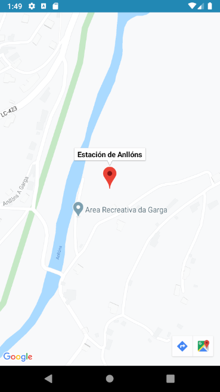

Podemos observar o nome da estación que estamos visualizando, así como dous botóns na parte inferior dereita onde correspondentemente, podemos trazar unha ruta ata ese destino, ou visualizar esa ubicación, a través de Google Maps.

### Ríos

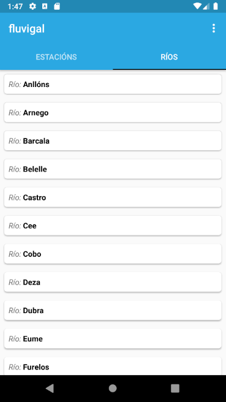

Como podemos ver, na pestana dos ríos, poderemos atopar un listado desprazable de todos os ríos controlados por Augas de Galicia, ordenados alfabéticamente polo seu nome, e ao facer click en calquera deles, levarasenos á seguinte pantalla, correspondente ao río seleccionado:

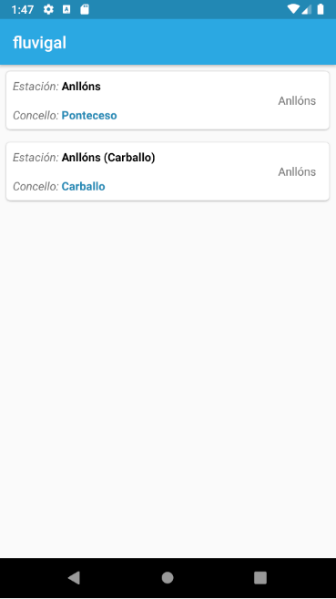

Nesta pantalla pódese ver o listado coas estacións, pero esta vez, filtradas polo río seleccionado previamente, e ordenadas alfabéticamente polo seu nome. Ao seleccionar calquera delas levaranos á pantalla de información sobre ésta, xa documentada na sección de [Estacións](#estacións):

### Sobre fluvigal

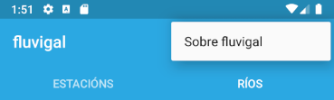

Como se pode ver na imaxe superior, ao tocar o botón da esquina superior dereita da pantalla principal, poderemos seleccionar o elemento "Sobre fluvigal", que nos levará á segunte pantalla:

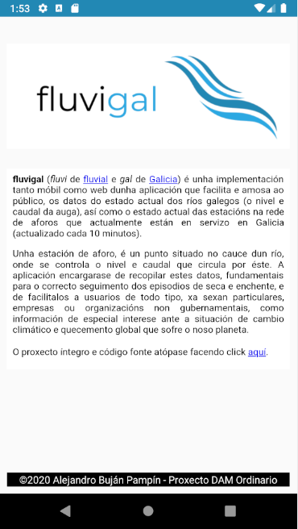

Aquí relátase información sobre o proxecto, a súa autoría, e onde atopar o código fonte. 