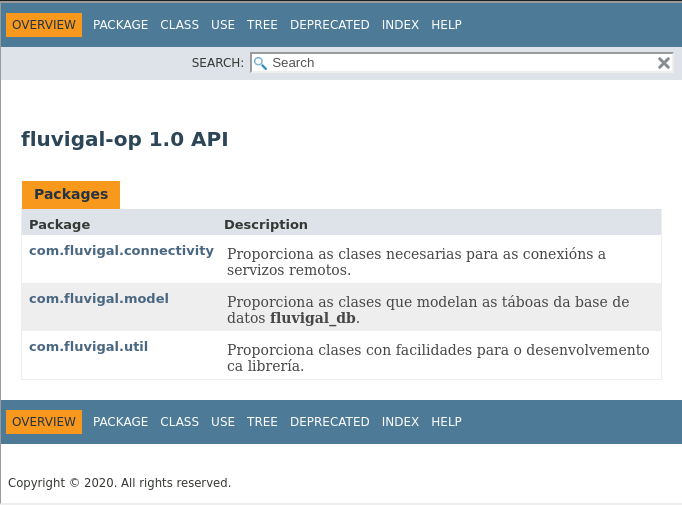

# fluvigal-op

__fluvigal-op__ é a librería empregada polas aplicacións cliente e frontend para comunicarse e recibir información da base de datos. Está desenvolta en [Java](https://www.java.com/es/).

Localizacion do .jar: 
    
    fluvigal-op/target/fluvigal-op-1.0.jar

>__IMPORTANTE__: fluvigal-op precisa de mariadb-java-client-1.8.0.jar como dependencia para o seu correcto funcionamento. Deben ser utilizados sempre en conxunto.

## Documentación

## Diagrama de clases - UML

