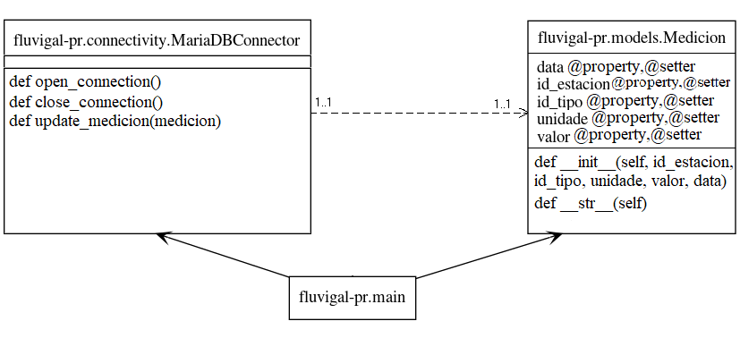

# fluvigal-pr

__fluvigal-pr__ é a aplicación empregada polo servidor ds-fluvigal para automáticamente recibir e procesar o ficheiro JSON emitido pola Xunta de Galicia onde se atopan os datos actualizados das medicións dos ríos. Encargarase de actualizar a base de datos cada 10 minutos con estes novos datos. Está desenvolta en [Python](https://www.python.org/).

Para instalala haberá que clonala e executar dende o servidor o script bash [fluvigal-pr-setup.sh](./fluvigal-pr-setup.sh).

>__IMPORTANTE__: fluvigal-pr precisará ter o servidor coa base de datos perfectamente configurada e implantada para un correcto funcionamento. Podes ver máis acerca da configuración [aquí](../ds-fluvigal/).

## Documentación

## Diagrama de clases - UML

